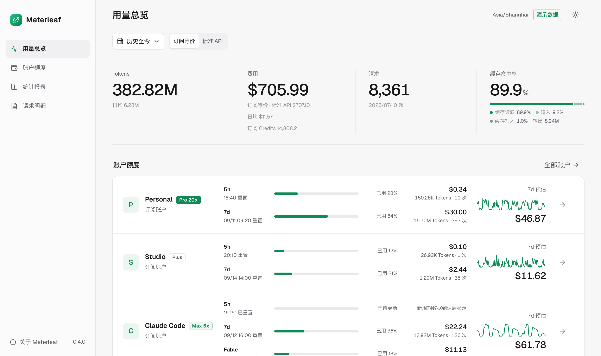
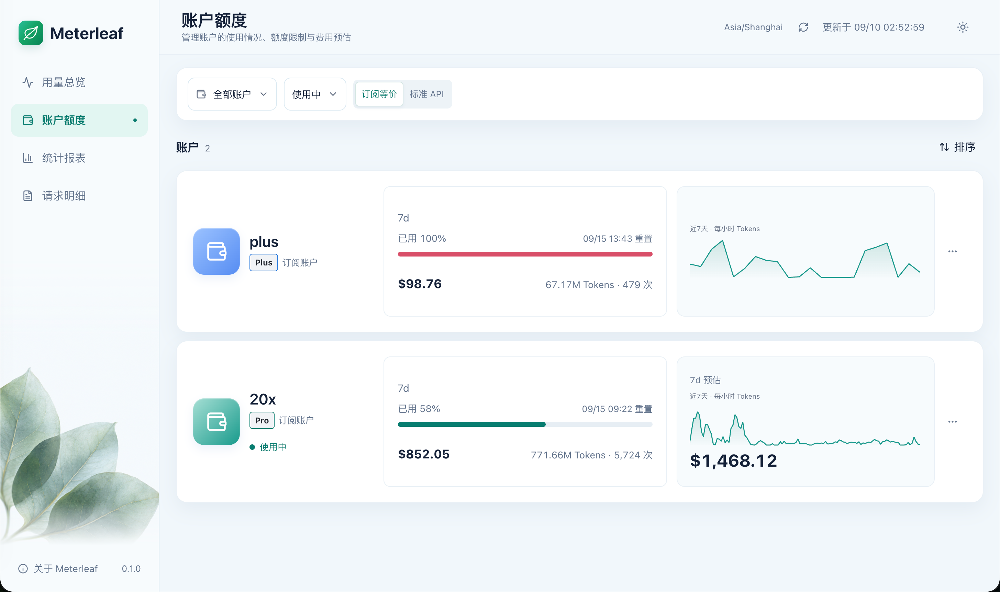
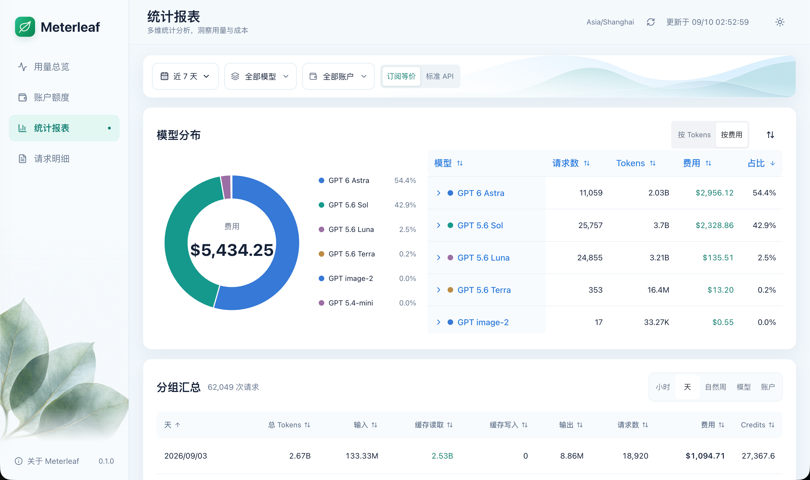
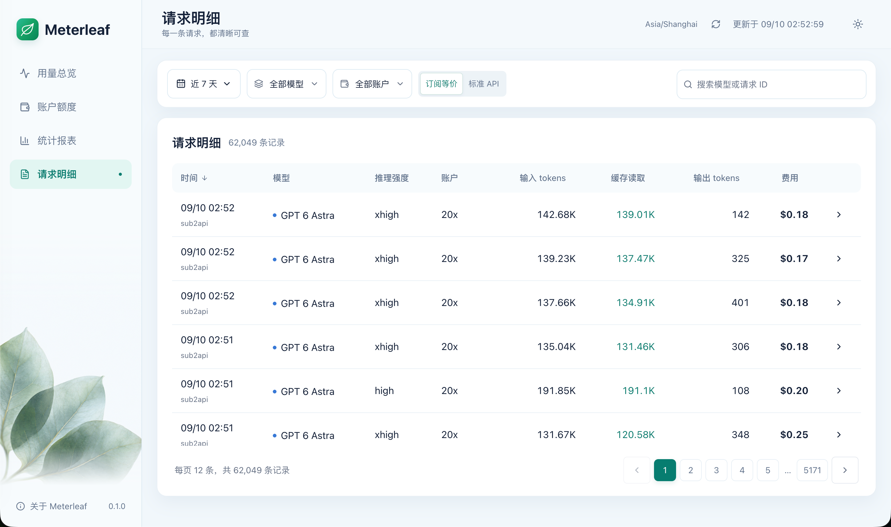
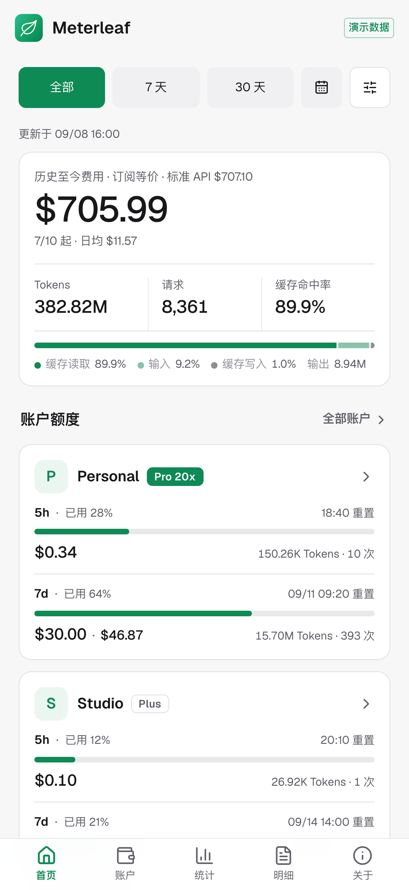
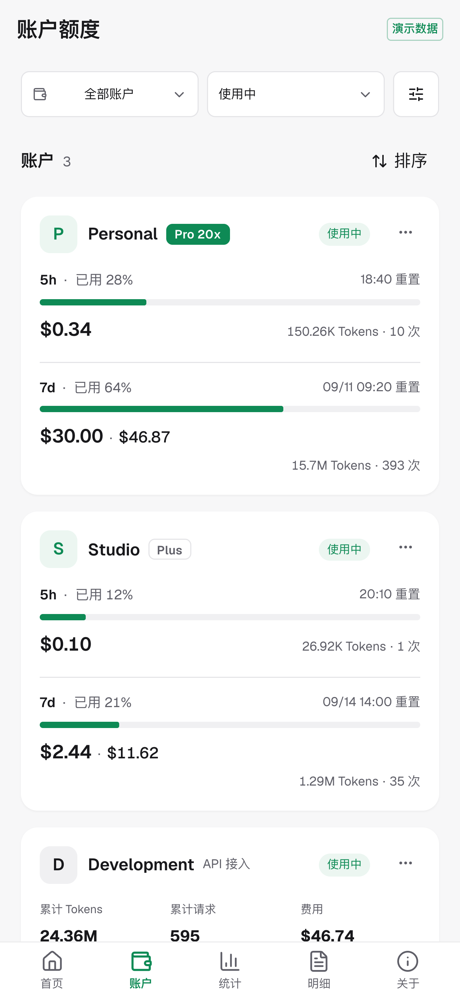
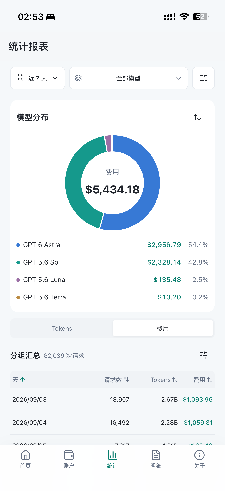
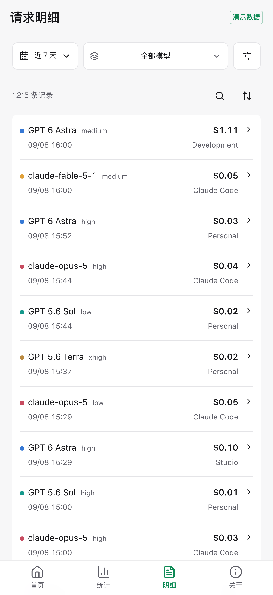

# Meterleaf

AI 用量账本，账户额度、Token 消耗、费用估算与多维统计。

Meterleaf 只读采集一个 Sub2API PostgreSQL 实例，也可以接收本机采集器推送的 Claude Code 本地直连用量，将用量保存到本地 SQLite 并生成独立报表。不代理模型请求、不修改 Sub2API，也不直接请求 OpenAI 或 Anthropic；单个容器即可运行。

## 能做什么

- **用量总览**：历史累计、账户额度与所选时段用量，配合消耗趋势和模型分布。
- **账户额度**：5 小时与 7 天窗口、重置时间及七天额度预估，支持排序和归档。
- **统计报表**：按小时、天、周、模型或账户汇总，比较 Tokens、请求数和费用。
- **请求明细**：查看模型、来源、推理强度、Token 拆分与计价依据。
- **独立估值**：同时保留订阅 Credits 与 USD，美元可切换订阅等价和标准 API 口径。

支持自定义日期、页面筛选、明暗主题和移动端；同步在后台进行，已有报表继续可读。

## 界面预览

### Web



<details>
<summary>账户额度</summary>



</details>

<details>
<summary>统计报表</summary>



</details>

<details>
<summary>请求明细</summary>



</details>

### 移动端

| 用量总览                                                                       | 账户额度                                                                       |
| ------------------------------------------------------------------------------ | ------------------------------------------------------------------------------ |
|  |  |

<details>
<summary>统计报表与请求明细</summary>

| 统计报表                                                                      | 请求明细                                                                       |
| ----------------------------------------------------------------------------- | ------------------------------------------------------------------------------ |
|  |  |

</details>

## 快速开始

当前支持一个 Sub2API PostgreSQL 实例。数据库账号只需读取 `public.accounts` 和 `public.usage_logs`，不需要写权限。

在仓库目录中准备配置：

```sh
cp .env.example .env
```

填写 `.env` 中的 `SUB2API_DATABASE_URL`，然后运行：

```sh
docker compose build
mkdir -p app_data
docker compose run --rm --no-deps --pull never --user root --entrypoint sh meterleaf -c 'chown bun:bun /app/app_data'
docker compose up -d --pull never
```

访问 `http://127.0.0.1:4318`，从右上角「数据同步」启动首次采集。默认不自动采集，可自行开启自动同步。

已发布镜像的拉取方式、跨主机访问、反向代理、配置项及备份恢复见[部署指南](docs/deployment.md)。应用不内置认证，可在反向代理层接入 OAuth/OIDC 认证。

## 文档

- [使用与报表](docs/reporting.md)：筛选、账户管理、同步显示及统计口径。
- [部署指南](docs/deployment.md)：安装、环境变量、升级、备份和排障。
- [计价说明](docs/pricing.md)：USD 分支、费率版本与自定义 JSON。
- [本机采集器](docs/collector.md)：接入本地直连的 Claude Code 用量、账户与额度。
- [贡献指南](AGENTS.md)：目录结构、代码规范、测试与提交要求。
- [版本与发布](docs/releasing.md)：版本递增、双架构镜像及 Release 流程。

本地演示无需上游凭据，需要 Bun 1.4.2 或更新版本：

```sh
bun install --frozen-lockfile
bun run dev:demo
```

## 许可证

[Apache-2.0](LICENSE)。第三方组件声明见 [THIRD_PARTY_NOTICES.md](THIRD_PARTY_NOTICES.md)。
