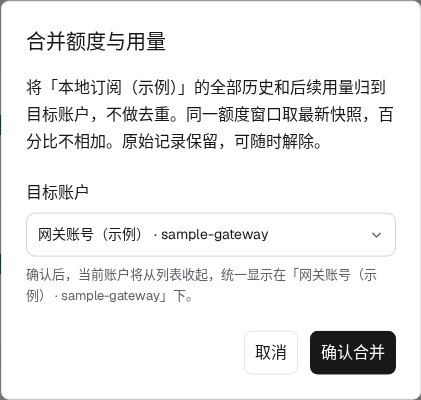

# 使用与报表

[返回首页](../README.md)

## 三个页面

| 页面     | 内容                                                         | 时间范围                                     |
| -------- | ------------------------------------------------------------ | -------------------------------------------- |
| 用量总览 | 所选范围的摘要、账户额度与账户管理、消耗趋势与模型分布       | 默认历史至今，可切换，账户额度始终按当前周期 |
| 统计报表 | 范围摘要、模型分布与小时、天、周、模型、账户分组汇总         | 按本页日期和筛选条件                         |
| 请求明细 | 来源、模型、推理强度、账户、Token 数和费用；点击查看完整证据 | 按本页条件筛选并在服务端分页                 |

总览的账户区列出每个账户的周期百分比、重置时间、Tokens、请求数、估算费用与七天预估。无额度快照的账户优先展示历史累计，缺少累计时才使用当前区间汇总。点击有额度的账户打开额度详情，点击其它账户打开它的请求明细。API 接入只表示接入方式；有快照时仍可展示订阅额度。

总览只按时间切换，不按模型或账户筛选。第一眼是总量和账户额度，默认范围「历史至今」从账本第一条记录起算。换成今天、近 7 天、近 30 天或自定义日期后，摘要、趋势和模型分布一起变化，账户额度仍按各自当前周期显示，不受范围影响。

摘要有四格。Tokens、费用和请求在历史至今下显示日均和起始日期，其它范围显示与上一个等长时段相比的环比，上期没有用量时显示「暂无对比」。缓存命中率是缓存读取占输入侧（普通输入、缓存读取、缓存写入）的比例，下方的条形图按这三部分拆开，输出 Tokens 不计入命中率，单独列出数量。趋势图下方给出峰值时段、有用量的时段数和单次请求平均值。点击模型分布中的模型，会带着同一范围打开统计报表。

统计报表顶部使用同样的摘要。分组汇总多一列缓存命中率，多于一行时末尾有合计行。

手机默认使用 App 模式，底部为首页、统计、明细和关于。首页顶部可在全部、近 7 天和近 30 天之间切换，日历按钮提供其它范围。可在“关于”中切换为侧栏模式；导航模式和主题会记住，重新打开仍然生效。

## 筛选与图表

快捷范围与自定义起止日期均支持，快捷范围的第一项是「历史至今」；完整有效的日期修改立即生效，无需应用按钮。自然日和自然周按 `Asia/Shanghai` 统计。

各页面独立记住日期、模型、账户、图表选项及适用的汇总维度和排序。搜索关键词和分页不保存。

主题、USD 估算口径和账户顺序全局共享。主题可以跟随系统，也可手动选择浅色或深色。配色与明暗相互独立，提供翠绿、靛蓝和黑白三种。

支持 PWA 的浏览器可使用原生安装入口，将 Meterleaf 安装为独立窗口。断网后重新打开时只显示离线提示，不显示旧账本；恢复网络后刷新页面获取当前数据。

消耗趋势支持小时、天、周粒度，可切换柱状图、折线图和面积图；饼图展示模型占比，不表示时间变化。USD、Credits 和 Tokens 使用同一份报表结果切换。

## 账户管理

账户管理都在总览的账户区完成，手机首页相同。

- 点击标题右侧的「排序」后，每个账户下方出现上移和下移按钮，点「完成」结束。新账户追加在末尾。
- 每个账户右侧的「⋯」菜单提供合并额度与用量、重命名、归档和删除。
- 同一账号从多个来源采集时，在来源账户菜单选择「合并额度与用量」，选定目标账户后确认。全部历史及后续用量都会归入目标，原来源记录仍可在请求明细查看，不做跨来源去重；若两个来源都记录了同一次请求，会累计两次。同一额度窗口使用最新快照，百分比不会相加，未知或到期状态仍如实显示。目标账户的名称和套餐保留。
- 在目标账户的「合并额度与用量」弹窗查看已合并账户，点击「解除合并」恢复各自展示。原始记录不删除，同步不会覆盖合并关系；连续合并多个账户时，解除某一层也会带回合并到它的账户。合并和解除后报表需要重新计算，数据较多时稍等片刻。
- 归档账户不在账户区显示。有归档账户时，标题右侧出现「已归档 N」，点击后查看归档列表，可在菜单中恢复或删除，点「使用中账户」返回。
- 删除账户只移除账户展示，不会删除历史请求、累计统计，也不影响 Sub2API 或本机采集器。
- 重命名的名称只在 Meterleaf 中显示，最长 40 个字，不会改动上游。清空名称或选择恢复原名后，重新显示上游提供的名称。
- 套餐徽标按使用倍数分三档显示，同一档外观相同。Claude Pro 与 ChatGPT Plus 为一档，Claude Max 5x 与 ChatGPT Pro 5x 为二档，Claude Max 20x 与 ChatGPT Pro 20x 为三档。无法识别的套餐只显示名称。
- 本地归档、删除状态和账户名称不会被同步覆盖。上游删除账户后，本地历史请求仍保留。

## 额度与金额

5 小时和 7 天窗口独立显示，过期窗口不沿用上一周期的百分比和统计。Claude 账户如果上报了 Fable 周额度，会在 7 天窗口下方单独显示一行。它只统计 Fable 模型的请求，费用和预估都不含其他模型；没有上报时不显示，也不按套餐推断有没有这项额度。账户整体 7 天额度用满时所有模型都不可用，这时只显示 7 天窗口。7 天额度有效时，5 小时窗口过期或暂时没有数据会保留位置并显示“等待更新”，收到新周期的额度数据后恢复；7 天额度用满时只显示 7 天窗口。页面停留或从后台恢复时也会检查到期时间。

七天预估表示按实际观测推算的整周额度价值。系统比较当前周期内多个额度快照之间的费用与百分比变化，每段至少跨越 5 个百分点，积累至少 3 个有效点对后取中位数。同一百分比的重复采样不会增加权重。5 小时窗口不做此预估。

本周期观测较少时优先参考同一来源的上一周期，有足够的多段观测后随当前观测跨度增加逐步调整，跨度达到 20 个百分点后完全使用本周期数据。上一周期也没有足够多段观测时，只有已观测到至少 10% 才把其加权粗估作为参考。没有可用历史时，按本周期不同百分比的累计消费加权粗估，较高百分比权重更大。账户详情说明估算依据。周期重置后重新积累当前样本，不参考久远周期；百分比回退后只使用回退后的观测。

手机上预估跟在已用费用之后，桌面账户列表在右侧单独显示。缺少有效比例、可计价消费或窗口失效时保留未知，不补零。快照可能包含其他入口的消费，本地请求只覆盖已采集来源，模型组合和供应商计量规则也可能变化，因此估值不是供应商承诺额度。

Tokens 总量由普通输入、缓存读取、缓存写入和输出组成。推理 Tokens 是输出子集，不能再相加。缺失金额保留未知；可计价部分的合计不代表完整费用。两种美元口径和订阅 Credits 的区别见[计价说明](pricing.md)。

## 更新与失败提示

页面会自动检查账本变化，有新数据时更新报表，回到页面时立即检查。右上角显示最近成功接收数据或完成同步的时间，可在「数据同步」中暂停页面自动更新；暂停不会停止采集器推送或后台同步。

连接了 Sub2API 时，还可从「数据同步」启动采集或开启自动同步。只接入本机采集器时显示推送状态，不提供拉取同步按钮；采集器自身的状态在那台电脑上用 `meterleaf-collector status` 查看。同步失败不会用演示数据替换已有账本。

后台刷新期间保留上次成功报表。首次查询没有缓存时仍需等待；读取失败与上游同步失败是不同问题，按提示说明的出错步骤排查，不要先清库。部署与日志操作见[部署指南](deployment.md)。

## 当前边界

请求详情按来源证据展示模型、推理强度、服务档位和耗时等字段，缺失字段不补默认值。当前尚不提供 CSV 导出、用户/API Key/网关分组统计、RPM/TPM、平均延迟或错误率报表。

Meterleaf 是独立用量账本，不是 Sub2API 管理面板的复刻；网关扣费与独立估值不能混为一个指标。
